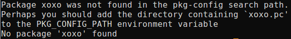
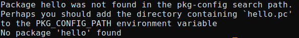

Guide to pkg-config
===================

原文地址: https://people.freedesktop.org/~dbn/pkg-config-guide.html

Concepts
---------

The primary use of ``pkg-config`` is to provide the necessary details for compiling and linking a program to a library.
This metadata is stored in pkg-config files.
These files have the suffix ``.pc`` and reside in specific locations known to the ``pkg-config`` tool. 

**The file format contains predefined metadata keywords and freeform variables.** 
An example may be illustrative:

.. code-block:: sh
    :emphasize-lines: 1, 2, 3, 4, 6, 7, 8, 9, 10

    prefix=/usr/local
    exec_prefix=${prefix}
    includedir=${prefix}/include
    libdir=${exec_prefix}/lib

    Name: foo
    Description: The foo library
    Version: 1.0.0
    Cflags: -I${includedir}/foo
    Libs: -L${libdir} -lfoo

The keyword definitions such as ``Name``: begin with a keyword followed by a colon and the value.
The variables such as ``prefix=`` are a string and value separated by an euqals sign.
The keywords are defined and exported by pkg-config.
The variables are not necessary, but can used by the keyword definitions for flxibility or store data not covered by ``pkg-config``\ .

Here is a short description of the keyword fields:

* ``Name``: A human-readable name for the library or package.
  This does not affect usage of the ``pkg-config`` tool, which uses the name of the *.pc* file.
* ``Description``: A brief description of the package.
* ``URL``: An URL where people can get more information about and download the package.
* ``Version``: A string specifically defining the version of the package.
* ``Requires``: A list of packages required by this package.
  The versions of these packages may be specified using the comparison operators ``=``, ``<``, ``>``, ``>=`` or ``<=``.
* ``Requires.private``: A list of private packages required by this package but not exposed to applications.
* ``Conflicts``: An optional field describing packages that this one conflicts with.
* ``Cflags``: The compiler flags specific to this pacakage and any required libraries that doesn't support ``pkg-config``\ . 
  If the required libraries support ``pkg-config``\ , they should be added to ``Requires`` or ``Requires.private``.
* ``Libs``: The link flags specific to this package and any required libraries that don't support ``pkg-config``\ .
* ``Libs.private``: The link flags for private libraries required by this package but not exposed to applications.

Writing pkg-config files
-------------------------

When creating pkg-config files for a package, it is necessary to decide how they will be distributed.
Each file is best used to describe a single library, so each package should have at least as many pkg-config files as they do installed libraries.

**The package name is determined through the filename of the pkg-config metadata file**.
This is the portion of the filename prior to the *.pc* suffix.
**A common choice is to match the library name to the .pc name**.
For instance, a package installing *libfoo.so* would have a corresponding *libfoo.pc* file containing the pkg-config metadata.
This choice is not necessary; the .pc file should simply be a unique identifier for your library.
Following the above example, *foo.pc* or *foolib.pc* would probably work just as well.

The ``Name``, ``Description`` and ``URL`` fields are purely informational and should be easy to fill in.
The ``Version`` field is a bit tricker to ensure that is is usable by comsumers of the data.
It is best that ``Version`` uses a dotted decimal number such as ``1.2.3``.
The number should be monotonically increasing and be as specific as possible in describing the library.
Usually it's sufficient to use the package's verison number here since it's easy for consumers to track.

Before describing the more useful fields, it will be helpful to demonstrate variable definitions.
The most common useage is to define the installation paths so that they don't clutter the metadata fields.
Since the variables are expanded recusively, this is very helpful when used in conjunction with autoconf derived paths.

.. code-block:: sh
    :emphasize-lines: 1, 2, 4
    
    prefix=/usr/local
    includedir=${prefix}/include

    Cflags: -I${includedir}/foo

The most import pkg-config metadata fields are ``Requires``, ``Requries.private``, ``Cflags``, ``Libs`` and ``Libs.private``.
They will define the metadata used by external projects to compile and link with the library.

``Requires`` and ``Requires.private`` define other modules needed by the library.
It is usually preferred to use the private variant of ``Requires`` to avoid exposing unnecessary libraries to the program that is linking with your library.
If the program will not be using the symbols of the required library, it should not be linking directly to that library.

Since ``pkg-config`` always exposes the link flags of the ``Requires`` libraries, these modules will become direct dependencies of the program.
On the other hand, libraries from ``Requires.private`` will only be included when static linking.
For this reason, it is usually only appropriate to add modules from the same package in ``Requires``.

The ``Libs`` field contains the link flags necessary to use that library.
In addtion, ``Libs`` and ``Libs.private`` contain link flags for other libraries not supported by ``pkg-config``.
Similar to the ``Requires`` field, it is preferred to add link flags for external libraries to the ``Libs.private`` field,
so programs do not acquire an addtional direct dependency. 

Finally, the ``Cflags`` contains the compiler flags for using the library.
Unlike the ``Libs`` field, there is not a private variant of ``Cflags``.
This is because the data types and macro definitions are needed regardless of the linking scenario.

Using pkg-config files
-----------------------

Assuming that there are *.pc* files installed on the system, the ``pkg-config`` tool is used to extract the metadata for usage. 

Consider a system with two modules, *foo* and *bar*.
Their *.pc* files might look like this:

*foo.pc:*

.. code-block:: sh
    :emphasize-lines: 1, 2, 3, 4, 6, 7, 8, 9, 10

    prefix=/usr
    exec_prefix=${prefix}
    includedir=${prefix}/include
    libdir=${prefix}/lib

    Name: foo
    Description: The foo library
    Version: 1.0.0
    Cflags: -I${includedir}/foo
    Libs: -L${libdir} -lfoo

*bar.pc:*

.. code-block:: sh
    :emphasize-lines: 1, 2, 3, 4, 6, 7, 8, 9, 10, 11

    prefix=/usr
    exec_prefix=${prefix}
    includefir=${prefix}/include
    libdir=${prefix}/lib

    Name: bar
    Description: The bar library
    Version: 2.1.2
    Requires.private: foo >= 0.7
    Cflags: -I${includedir}
    Libs: -L${libdir} -lbar
  
The version of the modules can be obtained with the ``--modversion`` option.

.. code-block:: sh
  :emphasize-lines: 1, 3

  $ pkg-config --modversion foo
  1.0.0
  $ pkg-config --modversion bar
  2.1.2

To print the link flags needed for each module, use the ``--libs`` option.

.. code-block:: sh
  :emphasize-lines: 1, 3
    
  $ pkg-config --libs foo
  -lfoo
  $ pkg-config --libs bar
  -lbar

Notice that ``pkg-config`` has suppressed part of the Libs field for both modules.
This is because the ``-L`` flag specially and knows that the ``${libdir}`` directory ``/usr/lib`` is part of the system linker search path.
This keeps ``pkg-config`` from interfering with the linker operation.

Also, although *foo* is required by bar, the link flags for  foo* are not output.
This is because *foo* is not directly needed by an applicaiton that only wants to use the *bar* library.
For statically linking a bar application, we need both sets of linker flags:

.. code-block:: sh
  :emphasize-lines: 1

  $ pkg-config --libs --static bar
  -lbar -lfoo

``pkg-config`` needs to output both sets of link flags in this case to ensure that the statically linked application will find all the necessary symbols.
On the other hand, it will always output all the ``Cflags``.

.. code-block:: sh
    :emphasize-lines: 1, 3

    $ pkg-config --cflags bar
    -I/usr/include/foo
    $ pkg-config --cflags --static bar
    -I/usr/include/foo

Another useful option, ``--exists``, can be used to test for a module's availability.

.. code-block:: sh
    :emphasize-lines: 1, 2

    $ pkg-config --exists foo
    $ echo $?
    $ 0

One of the nicest features of pkg-config is providing version checking.
It can be used to determine if a sufficient version is availavle.

.. code-block:: sh
    :emphasize-lines: 1

    # 使用pkg-config检查库的版本信息时, 语法格式为: pkg-config --libs "package-name >= 1.2.3"
    $ pkg-config --libs "bar >= 2.7"
    Requested 'bar >= 2.7' but version of bar is 2.1.2

Some commands will provide more verbose output when combined with the ``--print--errors`` option.

.. code-block:: sh
    :emphasize-lines: 1

    $ pkg-config --exists --print-errors xxxx

The message above references the ``PKG_CONFIG_PATH`` environment variable.
This variable is used to augment pkg-config's search path.
On a typical Unix system, it will search in the directories ``/usr/lib/pkgconfig`` and ``/usr/share/pkgconfig``.
This will usually cover system installed modules.
However, some local modules may be installed in a different prefix such as ``/usr/local``.
In that case, it's necessary to prepend the search path so that ``pkg-config`` can loatte the *.pc* files.

.. code-block:: sh
    :emphasize-lines: 1

    $ pkg-config --modversion hello

